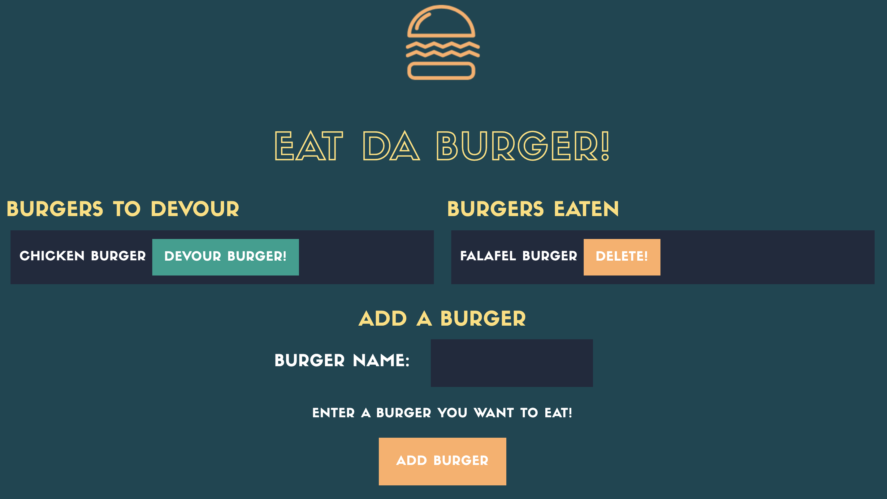

# burger-app

\*[Description](#Description)

\*[Installation](#Installation)

\*[Usage](#Usage)

\*[Contributing](#Contributing)

\*[Testing](#Testing)

\*[License](#License)

## Description

This project utilizes MySQL, Node, Express, Handlebars, and a homegrown ORM to accomplish the following:

- A user can type a burger name and submit it. The burger app will display the burger on the left side of the page waiting to be devoured

- Each burger on the left side of the page has a `Devour It` button. When the user clicks it, the burger will move to the right side of the page

- The burgers are stored in a database, whether devoured or not

To view the final application demo, please use this link:

- https://boiling-harbor-29648.herokuapp.com/

# Installation

The code for the Burger App can be found on github using the following link:

- https://github.com/shelbyandersen/burger-app

# Usage

The Burger App uses Node, Express, MySQL, Handlebars, and a homemade ORM to create and store data for the application.

The database schema contains a burgers table:

- **burgers**:

  - **id** - INT PRIMARY KEY
  - **name** - VARCHAR(30) to hold burger name
  - **isDevoured** - BOOLEAN

  The `orm.js` file creates the methods that will execute the necessary MySQL commands in the controllers. These methods are used to retrieve and store data in the database.

# Contributing

The initial design of this application was provided by Trilogy Educational Services. A redesign was created and coded by Shelby Andersen.

The application was completed by Shelby Andersen.

# Testing

To test this application you will need to fork the repo here:

- https://github.com/shelbyandersen/burger-app

Then, run `npm install` to install the necessary packages. You will need to run `node server.js` to begin the application in your integrated terminal.

# License

MIT License

Copyright (c) [2020] [Shelby Andersen]

Permission is hereby granted, free of charge, to any person obtaining a copy of this software and associated documentation files (the "Software"), to deal in the Software without restriction, including without limitation the rights to use, copy, modify, merge, publish, distribute, sublicense, and/or sell copies of the Software, and to permit persons to whom the Software is furnished to do so, subject to the following conditions: The above copyright notice and this permission notice shall be included in all copies or substantial portions of the Software.

THE SOFTWARE IS PROVIDED "AS IS", WITHOUT WARRANTY OF ANY KIND, EXPRESS OR IMPLIED, INCLUDING BUT NOT LIMITED TO THE WARRANTIES OF MERCHANTABILITY, FITNESS FOR A PARTICULAR PURPOSE AND NONINFRINGEMENT. IN NO EVENT SHALL THE AUTHORS OR COPYRIGHT HOLDERS BE LIABLE FOR ANY CLAIM, DAMAGES OR OTHER LIABILITY, WHETHER IN AN ACTION OF CONTRACT, TORT OR OTHERWISE, ARISING FROM, OUT OF OR IN CONNECTION WITH THE SOFTWARE OR THE USE OR OTHER DEALINGS IN THE SOFTWARE.

© 2020 Shelby Andersen in Collaboration with Georgia Tech Coding Boot Camp. All Rights Reserved.
